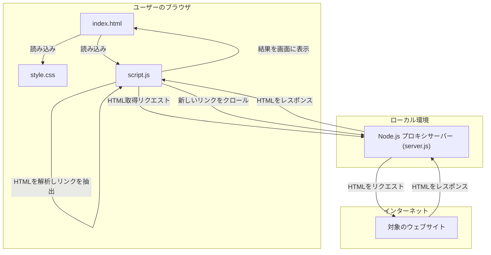

# サイトマップジェネレータ


指定した URL からウェブサイトをクロールし、ページタイトルと URL のリスト形式でサイトマップを生成するツールです。

## 主な機能

-   **サイトクロール**: 開始 URL からサイト内のリンクをたどり、ページを自動的に収集します。
-   **階層指定クロール**: 開始 URL で指定された階層（ディレクトリ）とその配下のみをクロールの対象とします。例えば、`/ja/products/` を指定した場合、`/ja/about/` のような別の階層はクロールしません。
-   **タイトル取得**: 各ページの `<title>` タグからページタイトルを抽出します。
-   **リアルタイム表示**: 収集したページをリアルタイムでリストに表示します。
-   **生成停止**: サイトの規模が大きい場合など、途中でクロールを停止する機能があります。

## ファイル構成

プロジェクトは以下のファイルで構成されています。

-   `index.html`: アプリケーションの基本構造を定義する HTML ファイル。
-   `style.css`: アプリケーションのスタイルを定義する CSS ファイル。
-   `script.js`: クロール処理や DOM 操作など、アプリケーションの動作を記述する JavaScript ファイル。
-   `server.js`: CORS ポリシーを回避するためのバックエンドプロキシサーバー。
-   `package.json`: プロジェクトの依存関係を管理するファイル。

## アーキテクチャ

このツールは、クライアントサイドで動作するフロントエンドと、CORS ポリシーを回避するためのシンプルなバックエンドプロキシで構成されています。



1.  **フロントエンド (`index.html`, `style.css`, `script.js`)**
    -   ユーザーインターフェースを提供し、サイトマップ生成の開始と停止を制御します。
    -   `script.js` が、プロキシサーバー経由で取得した HTML を解析し、DOM からページタイトルとリンク (`<a>` タグ) を抽出します。
    -   収集したページをリスト形式でリアルタイムに表示します。
    -   クロール済みの URL を管理し、無限ループを防ぎます。

2.  **バックエンド (`server.js`)**
    -   Node.js と Express で構築されたプロキシサーバーです。
    -   フロントエンドからのリクエストを受け取り、`puppeteer` を使用してヘッドレスブラウザ (Chromium) を起動し、対象のウェブサイトから HTML コンテンツを取得します。
    -   `puppeteer` を利用することで、JavaScript によって動的に生成されるコンテンツや、Cloudflare などの高度なボット対策が施されたサイトからもデータを取得できます。
    -   `cors` ミドルウェアを使用することで、ブラウザの同一オリジンポリシー (SOP) に起因する CORS エラーを回避します。
    -   取得した HTML をそのままフロントエンドに返します。

## 必要なもの

-   [Node.js](https://nodejs.org/) (v14 以降を推奨)
-   [npm](https://www.npmjs.com/) (Node.js に同梱)

## 実行方法

1.  **依存パッケージのインストール**:
    プロジェクトのルートディレクトリで、ターミナルを開き、以下のコマンドを実行します。
    ```bash
    npm install
    ```
    **注意:** このコマンドは `puppeteer` をインストールします。`puppeteer` は初回インストール時に、ヘッドレスブラウザとして動作する Chromium (約170MB) をダウンロードするため、インターネット接続が必要です。インストールには数分かかる場合があります。

2.  **プロキシサーバーの起動**:
    次に、プロキシサーバーを起動します。
    ```bash
    node server.js
    ```
    ターミナルに `✅ Proxy server with Puppeteer is running on http://localhost:3000` と表示されれば成功です。

3.  **ツールの使用**:
    ウェブブラウザで `index.html` ファイルを開きます。
    -   入力欄にサイトマップを生成したいウェブサイトの URL を入力します。
    -   「サイトマップ生成開始」ボタンをクリックすると、クロールが始まります。
    -   生成を途中で止めたい場合は、「生成を停止」ボタンをクリックしてください。

## 免責事項

このツールは十分なテストが行われていません。使用は自己責任でお願いします。
